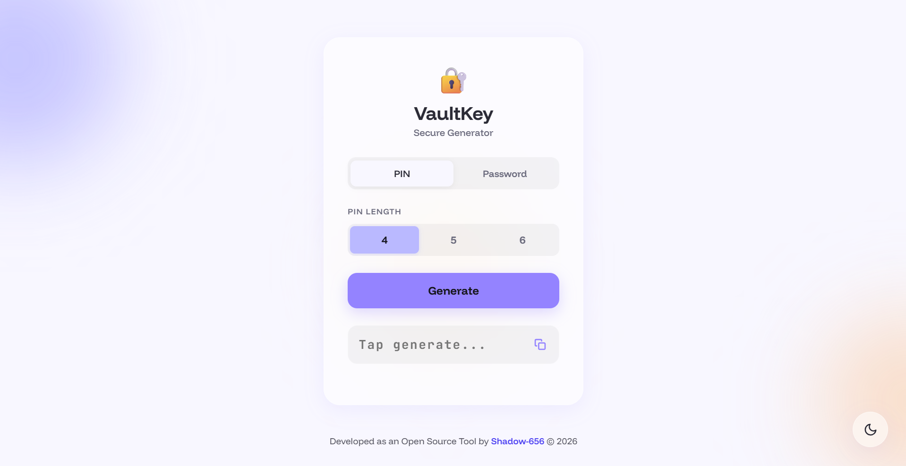

<div align="center">
  
  
  <h1>🔐 VaultKey</h1>
  <p><strong>A secure, client-side PIN & Password Generator wrapped in a modern liquid-glass UI.</strong></p>

  <a href="https://YOUR_GITHUB_USERNAME.github.io/VaultKey/"><strong>Explore the Live App »</strong></a>
  
  <br>
  <br>

  [](#)
  [](#)
  [](#)
  [](#)
</div>

---

## 📖 About The Project

VaultKey is a lightweight, Progressive Web App (PWA) designed to generate highly secure, customizable passwords and PINs instantly. Built entirely with vanilla web technologies, the app executes all logic locally in your browser, ensuring maximum privacy and zero data transmission.

The user interface was crafted with a focus on premium aesthetics, utilizing a "Glassmorphism" design system, fluid CSS animations, and a soothing pastel color palette that adapts beautifully to both mobile and desktop environments.

### ✨ Key Features

* **Pronounceable Passwords:** An intelligent "Easy to Say" algorithm generates alternating consonant/vowel combinations for memorable, yet secure, keys.
* **Mutually Exclusive Logic:** Seamless, smart UI toggles prevent conflicting parameter selections during password generation.
* **One-Tap Clipboard Integration:** Tap the output container to instantly copy the generated key with visual toast feedback.
* **Progressive Web App:** Installable on any mobile or desktop device for complete offline functionality.
* **Native Theming:** A seamless dark/light mode toggle built with CSS variables for instant, flash-free theme switching.

---

## 📸 Interface Snapshot

<div align="center">
  
</div>

---

## 🚀 Local Setup

To run this project locally, simply clone the repository. No build tools or package managers are required.

1. Clone the repository:
   ```sh
   git clone [https://github.com/YOUR_GITHUB_USERNAME/VaultKey.git](https://github.com/YOUR_GITHUB_USERNAME/VaultKey.git)