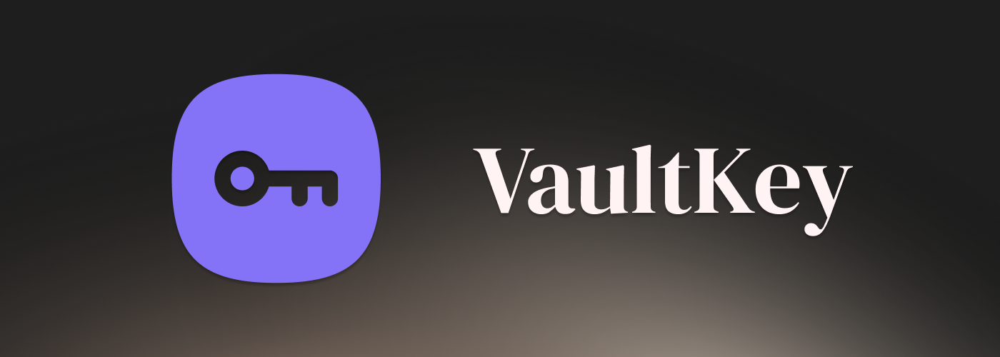

  
  
  <h1>🔐 VaultKey</h1>
  
<strong>A secure, client-side PIN & Password Generator wrapped in a modern liquid-glass UI.</strong>

  <a href="https://shadow-656.github.io/VaultKey-Generator/"><strong>Explore the Live App »</strong></a>
  
   
   

  
  
  
  

---

## 📖 About The Project

VaultKey is a lightweight, Progressive Web App (PWA) designed to generate highly secure, customizable passwords and PINs instantly. Built entirely with vanilla web technologies, the app executes all logic locally in your browser, ensuring maximum privacy and zero data transmission.

The user interface was crafted with a focus on premium aesthetics, utilizing a "Glassmorphism" design system, fluid CSS animations, and a soothing pastel color palette that adapts beautifully to both mobile and desktop environments.

### ✨ Key Features

* **Pronounceable Passwords:** Generates easy-to-remember passwords using consonant–vowel patterns.
* **Mutually Exclusive Logic:** Prevents conflicting options automatically.
* **One-Tap Clipboard Integration:** Tap to copy passwords instantly with toast feedback.
* **Progressive Web App:** Installable and works fully offline.
* **Native Theming:** Smooth light/dark mode with instant switching.

---

## 📸 Interface Snapshot

  

---

## License

This project is licensed under the MIT License - see the [LICENSE](LICENSE) file for details.

## Author

- **Shadow-656** - [GitHub Profile](https://github.com/Shadow-656)